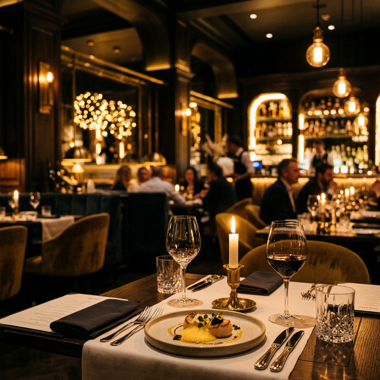

# 🍽️ Elegance - Premium Fine Dining Restaurant Website



A modern, highly attractive, and fully responsive restaurant website built using **HTML, CSS, JavaScript, and PHP with MySQL**. Designed to reflect a premium restaurant brand, this project features a dark elegant theme, smooth scroll animations, glassmorphism UI elements, and a fully functional dynamic backend.

🌟 **Live Demo:** [https://deme-restaurent.free.nf/](https://deme-restaurent.free.nf/)

---
*This project was developed as a portfolio piece showcasing both premium frontend UI design and dynamic backend integration.*

**Interested in a website like this?** Feel free to contact me to build a premium, custom website for your business!

### 📬 Contact Me

*   **Email:** [rihamahamed625@gmail.com](mailto:rihamahamed625@gmail.com) 
*   **LinkedIn:** [Riham Hanifa](https://www.linkedin.com/in/riham-hanifa) 


## ✨ Features

### 🎨 Frontend UI/UX
*   **Premium Dark Theme:** Deep black background with warm golden accents and soft white typography.
*   **Modern Aesthetics:** Fully responsive design utilizing CSS Grid and Flexbox.
*   **Glassmorphism Effects:** Translucent cards with soft backdrop blurs and subtle hover glow box-shadow effects.
*   **Smooth Animations:** Scroll-based intersection observer logic for elements fading and sliding into view.
*   **Dynamic Filtering:** JavaScript-powered category filtering on the Menu page (no page reloads).
*   **Interactive Elements:** Hover animations on buttons, cards, and image zoom effects.

### ⚙️ Backend & Database
*   **Dynamic Menu System:** Menu items are pulled directly from the MySQL database.
*   **Reservation System:** A fully functional booking form that captures requests, validates data, and stores them in the database.
*   **Secure Admin Panel:** Login gateway utilizing PHP sessions and password hashing (`admin / admin123`).
*   **Admin Dashboard:** 
    *   View all live reservation requests and easily switch their status (Pending, Accepted, Rejected).
    *   Manage the dynamic menu (Add / Delete dishes and beverages).

## 🛠️ Technology Stack

*   **Frontend:** HTML5, Vanilla CSS3 (Custom Variables, Grid, Flexbox), Vanilla JavaScript (DOM manipulation, Intersection Observer).
*   **Backend:** PHP 8+ (PDO for secure database interactions).
*   **Database:** MySQL.
*   **Fonts & Icons:** Google Fonts (Poppins), FontAwesome 6.

## 📂 Project Structure

```
/
├── admin/               # Admin panel files (login, dashboard, logout)
├── assets/              # Additional static assets
├── config/
│   └── db.php           # PDO Database connection template
├── css/
│   └── style.css        # Global stylesheet including glassmorphism and animations
├── images/              # AI-generated premium food photography and backgrounds
├── js/
│   └── script.js        # Global UI Logic, scroll animations, mobile menu
├── database.sql         # SQL dump file containing schema and dummy data
├── index.php            # Home page (Hero, Featured dishes, Testimonials)
├── menu.php             # Dynamic menu page with JS filtering
├── booking.php          # Reservation form page
├── contact.php          # Contact details and Google Maps integration
└── setup.php            # Automated database initialization script
```

## 🚀 Getting Started

Follow these steps to set up the project locally on your machine.

### Prerequisites
*   A local server environment like **XAMPP, WAMP, or MAMP**.
*   PHP 7.4 or higher.
*   MySQL.

### Installation Steps

1.  **Clone the Repository**
    ```bash
    git clone https://github.com/your-username/elegance-restaurant.git
    cd elegance-restaurant
    ```

2.  **Database Setup**
    *   Start your local MySQL server (via XAMPP/WAMP).
    *   You have two options to set up the database:
        *   **Option A (Automated):** Simply run the `setup.php` script from your browser or CLI (e.g., `php setup.php`). This will automatically create the `restaurant_db` database, create all tables, and insert default data based on `database.sql`.
        *   **Option B (Manual):** Create a new database named `restaurant_db` in phpMyAdmin. Import the `database.sql` file into this newly created database.

3.  **Run the Server**
    *   If using XAMPP/WAMP, place the project folder inside your `htdocs` or `www` directory, then navigate to `http://localhost/elegance-restaurant` in your browser.
    *   Alternatively, you can use PHP's built-in development server from your terminal:
        ```bash
        php -S localhost:8000
        ```
        Then, open your browser and go to `http://localhost:8000`.

### 🔐 Admin Panel Access

To manage bookings and the menu, access the admin panel at:
`http://localhost:8000/admin/login.php`

**Demo Credentials:**
*   **Username:** `admin`
*   **Password:** `admin123`

